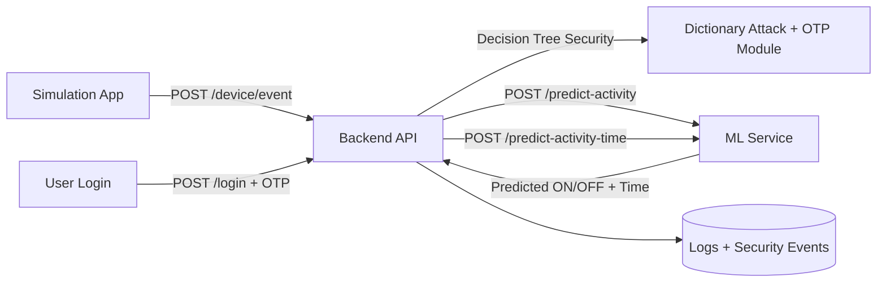

# Smart Home Research Architecture

## System Diagram

## ML Flow
1. Historical activity dataset is loaded by the ML service.
2. `POST /train-model` trains a neural network classifier (MLP).
3. Trained model is saved to `apps/ml/models/activity_model.joblib`.
4. Backend requests `POST /predict-activity` and `POST /predict-activity-time`.
5. Deviation report compares actual event time with predicted activity time.

## Authentication Flow
1. `POST /login` validates username/password.
2. Decision tree checks dictionary attack conditions.
3. OTP is generated and sent by notification adapters.
4. OTP expires after 10 minutes.
5. `POST /verify-otp` validates OTP with second-level dictionary detection.

## Device Prediction Flow
1. Simulator emits device usage events.
2. Backend logs event context (device, location, timestamp, status).
3. Backend requests ON/OFF and activity-time prediction.
4. Deviation report outputs actual vs predicted time and standard deviation.

## Research Alignment
- Preserves smart home activity prediction objective.
- Implements secured access via 10-minute OTP workflow.
- Implements decision-tree dictionary detection at login and OTP phases.
- Stores attacker IP and dictionary phrase indicators.
- Uses historical IoT device behavior to predict appliance state and activity timing.
